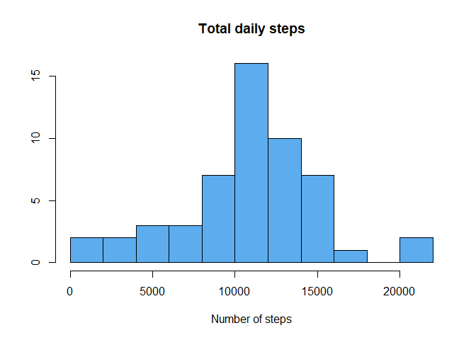
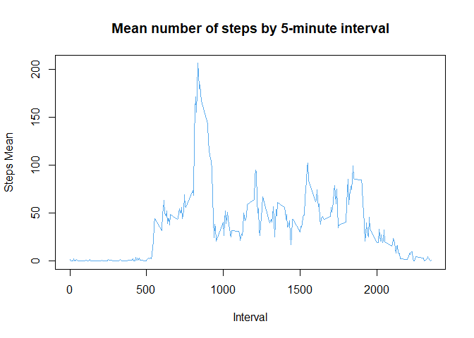
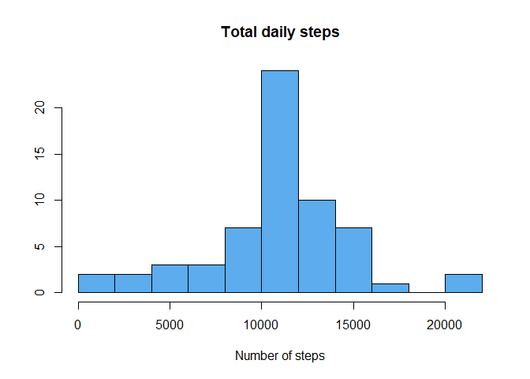

## Loading and preprocessing the data
The data set consists of data for the number of steps taken by an individual in 5-minute intervals during 2 months (2012-10-01 to 2012-11-30). It was available on the git repository for the class, zipped on the "activity.zip" file. Unzipping the file was done as below:


```r
unzip("activity.zip",list=TRUE) #checking documents in zip file
```

```
##           Name Length                Date
## 1 activity.csv 350829 2014-02-11 10:08:00
```

```r
unzip("activity.zip") #unzipping csv file inside zip file
```

The file within the zip file had the same name and was available in the .csv format.

Therefore, it was not necessary to download the file, only load it into RStudio using the *read.csv* function:


```r
activity <- read.csv(file="activity.csv")
```

## What is mean total number of steps taken per day?
As advised by the assignment guidelines, the first task consisted of removing the NA values. To do that, first it was checked if the NA values were present only in the "steps" column and how many observations happened to have NA values:


```r
sum(is.na(activity$steps))
```

```
## [1] 2304
```

```r
sum(is.na(activity$date))
```

```
## [1] 0
```

```r
sum(is.na(activity$interval))
```

```
## [1] 0
```

Once it was done, the NA values observations were removed from the data in the next step:


```r
activ_non_na <- na.omit(activity)
```

The data was grouped by dates and then the total daily steps was calculated and summarized in a table alongside the date variable (using the dplyr package):


```
## 
## Attaching package: 'dplyr'
```

```
## The following objects are masked from 'package:stats':
## 
##     filter, lag
```

```
## The following objects are masked from 'package:base':
## 
##     intersect, setdiff, setequal, union
```

```
## ------------------------------------------------------------------------------
```

```
## You have loaded plyr after dplyr - this is likely to cause problems.
## If you need functions from both plyr and dplyr, please load plyr first, then dplyr:
## library(plyr); library(dplyr)
```

```
## ------------------------------------------------------------------------------
```

```
## 
## Attaching package: 'plyr'
```

```
## The following objects are masked from 'package:dplyr':
## 
##     arrange, count, desc, failwith, id, mutate, rename, summarise,
##     summarize
```

```r
activ_arranged <- group_by(activ_non_na,date)
totaldailysteps <- aggregate(steps~date, data=activ_arranged, FUN=sum)
```

The histogram was constructed using the hist() function of the base plotting system to evaluate the most common range of values of total daily steps:


```r
hist(totaldailysteps$steps, breaks=8, col=c("steelblue2"),main="Total daily steps", xlab="Number of steps",ylab="")
```

<!-- -->

Finally, the mean and median were evaluated:


```r
dailysteps_summary <- summarize(totaldailysteps,meansteps=mean(steps),mediansteps=median(steps))
print(dailysteps_summary)
```

```
##   meansteps mediansteps
## 1  10766.19       10765
```


## What is the average daily activity pattern?

The data, already cleaned to remove NA values, was grouped by the respective 5-minute interval in which was taken and the grouped data (activ_arranged2) was then used to calculate the means of steps taken by interval:


```r
activ_arranged2 <- arrange(activ_non_na,interval)
activ_arranged2 <- group_by(activ_non_na,interval)
meandailysteps <- aggregate(steps~interval, data=activ_arranged2, FUN=mean)
head(meandailysteps)
```

```
##   interval     steps
## 1        0 1.7169811
## 2        5 0.3396226
## 3       10 0.1320755
## 4       15 0.1509434
## 5       20 0.0754717
## 6       25 2.0943396
```

The plot of mean daily steps by each interval was then taken:


```r
with(meandailysteps, plot(interval, steps,type="l", main="Mean number of steps by 5-minute interval", xlab="Interval", ylab="Steps Mean", col="steelblue2",pch=))
```

<!-- -->

To end the analysis, the *meandailysteps* dataframe was subsetted in order to find the observations which had the maximum value of steps mean, which ended up being interval 835, corresponding to 08:35 a.m.:


```r
subset(meandailysteps, steps==max(meandailysteps$steps)) #interval 835
```

```
##     interval    steps
## 104      835 206.1698
```


## Imputing missing values

It was defined by the assignment's guidelines, that the missing values should not be removed from the data but it should be replaced by the mean value for that specific interval.

In order to do that, the raw data (*activity* data frame) was used to filter out all the non-NA values, maintaining only NA values in it (*activ_na* data frame) and then the data frame obtained was joined with the *meandailysteps* data frame by the interval variable to produce a new *activ_na* df that had the interval variable and the stepsmean variable together:


```r
activ_na <- filter(activity, is.na(steps))
activ_na <- join(activ_na,meandailysteps,by=c("interval"))
```

The steps variable was excluded and the stepsmean variable was renamed as steps. This way, the NA values were now replaced by the mean values of steps for the corresponding intervals:


```r
activ_na <- activ_na[,2:4]
colnames(activ_na)<-c("date","interval","steps")
```

The non NA values data (*activ_non_na* df), now with NA values replaced by means, and the NA values data (*activ_na* data) were remerged, the df resulted of it (*activity_na_imput* df) was grouped by date and then the total number of steps for each date was calculated unsing the *aggregate* function:


```r
activity_na_imput <- rbind(activ_na,activ_non_na)
activ_arranged3 <- group_by(activity_na_imput,date)
totaldailysteps2 <- aggregate(steps~date, data=activ_arranged3, FUN=sum)
head(totaldailysteps2)
```

```
##         date    steps
## 1 2012-10-01 10766.19
## 2 2012-10-02   126.00
## 3 2012-10-03 11352.00
## 4 2012-10-04 12116.00
## 5 2012-10-05 13294.00
## 6 2012-10-06 15420.00
```

Finally, the histogram was plotted again with the now corrected NA values data, followed by the evaluation of the mean and median of the data:


```r
hist(totaldailysteps2$steps, breaks=8, col=c("steelblue2"),main="Total daily steps", xlab="Number of steps",ylab="")
```

<!-- -->

```r
dailysteps_summary2 <- summarize(totaldailysteps2,meansteps=mean(steps),mediansteps=median(steps))
```

## Are there differences in activity patterns between weekdays and weekends?

To evaluate if there were differences in patterns between weekdays and weekends, firstly it was necessary to turn the date variable from a character object to a date object and then insert a weekday variable into the data frame (*activity_na_imput* df):


```r
activity_na_imput$date <- as.Date(activity_na_imput$date)
activity_na_imput <- mutate(activity_na_imput, weekday=weekdays(activity_na_imput$date))
```

The weekdays were then replaced by their respective factor (example: "saturday" was changed to "Weekend" and "monday" to "Weekday").

**OBS:** In case of doubt, the weekdays are represented below in portuguese:


```r
activity_na_imput$weekday <- gsub("sábado","Weekend",activity_na_imput$weekday)
activity_na_imput$weekday <- gsub("domingo","Weekend",activity_na_imput$weekday)
activity_na_imput$weekday <- gsub("segunda-feira","Weekday",activity_na_imput$weekday)
activity_na_imput$weekday <- gsub("terça-feira","Weekday",activity_na_imput$weekday)
activity_na_imput$weekday <- gsub("quarta-feira","Weekday",activity_na_imput$weekday)
activity_na_imput$weekday <- gsub("quinta-feira","Weekday",activity_na_imput$weekday)
activity_na_imput$weekday <- gsub("sexta-feira","Weekday",activity_na_imput$weekday)
activity_na_imput$weekday <- as.factor(activity_na_imput$weekday)
```

The data was arranged by date and then the mean number of steps by date as calculated using function *aggregate* of the *dplyr* package


```r
activ_arranged4 <- group_by(activity_na_imput,date)
meandailysteps2 <- aggregate(steps~interval+weekday, data=activ_arranged4, FUN=mean)
```

Finally, two plots were constructed in the lattice system using the steps and interval variables, one corresponding to the *Weekday* days data and the other one to the *Weekend* days data:


```r
library(lattice)
meandailysteps2 <- transform(meandailysteps2, weekday=factor(weekday))
xyplot(steps~interval|weekday, data=meandailysteps2, layout=c(1,2), type="l")
```

<!-- -->


#THE END
